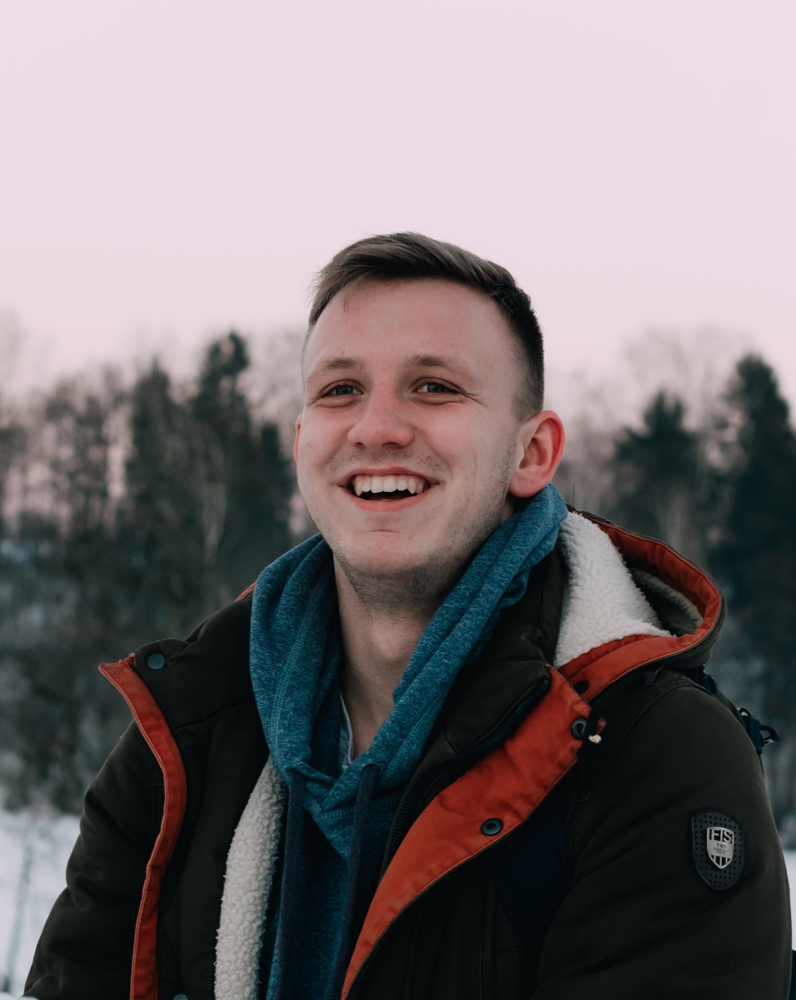

<!--  -->

# Станислав Рябчинский

## Контакты:

- **Телефон, Viber:** +375 29 62 30 260;
- **E-mail:** stanislavr999@gmail.com.
<!-- - **LinkedIn** . -->

## Обо мне:

Мне 24 года. Работал в компании "Ancor" Менеджером по закупкам более 4-х лет. Это был интересный и полезный опыт, компания занималась поставками светотехнической продукции "Phillips" для потребительских и промышленных нужд.

Более года назад открыл для себя новое направление в сфере IT — *Frontend* разработчик. Работа в сфере IT заинтересовала меня свом огромным количеством направлений и языковых сред, что позволяет всегда развиваться и изучать новое. Мое обучение проходило как самостоятельное изучение материала, так с помощью разных образовательных платформ и в последущем, с помощью ментора. 
Испытываю огромный интерес к работе и изучение нового материала. 

На данный момент работаю в компании EasyTech младшим Frontend разработчиком.
## Курсы:

- HTML and CSS on the FreeCodeCamp;
- JavaScript on the learnjavascript.ru;
- RS Schools Course «JavaScript/Front-end» (незакончено).

## Профессиональные навыки:

- HTML5, CSS3;
- JavaScript;
- React , React Router, React intesection observer, React-sticky-el;
- Typescript;
- REST API;
- Mobx;
- Ant Design;
- Git/GitHub Basics;
- Адаптивная/кроссбраузерная верстка;
- БЭМ.

## Опыт в проектах:

- ### Разработка сайта для компании
  - *Длительность проекта* — 14 дней;
  - *Роль* — Frontend developer;
  - *Численность команды* — 1 разработчик;
  - *Описание* — Верстка сайта по макету figma;
  - *Стек технологий* — React, react-sticky-el, react intesection-observer, emailJS, CSS.
- ### Разработка сайта для компании
  - *Длительность проекта* — 14 дней;
  - *Роль* — Frontend developer;
  - *Численность команды* — 1 разработчик;
  - *Описание* — Верстка сайта по макету figma;
  - *Стек технологий* — React, react-sticky-el, react intesection-observer, emailJS, CSS.

